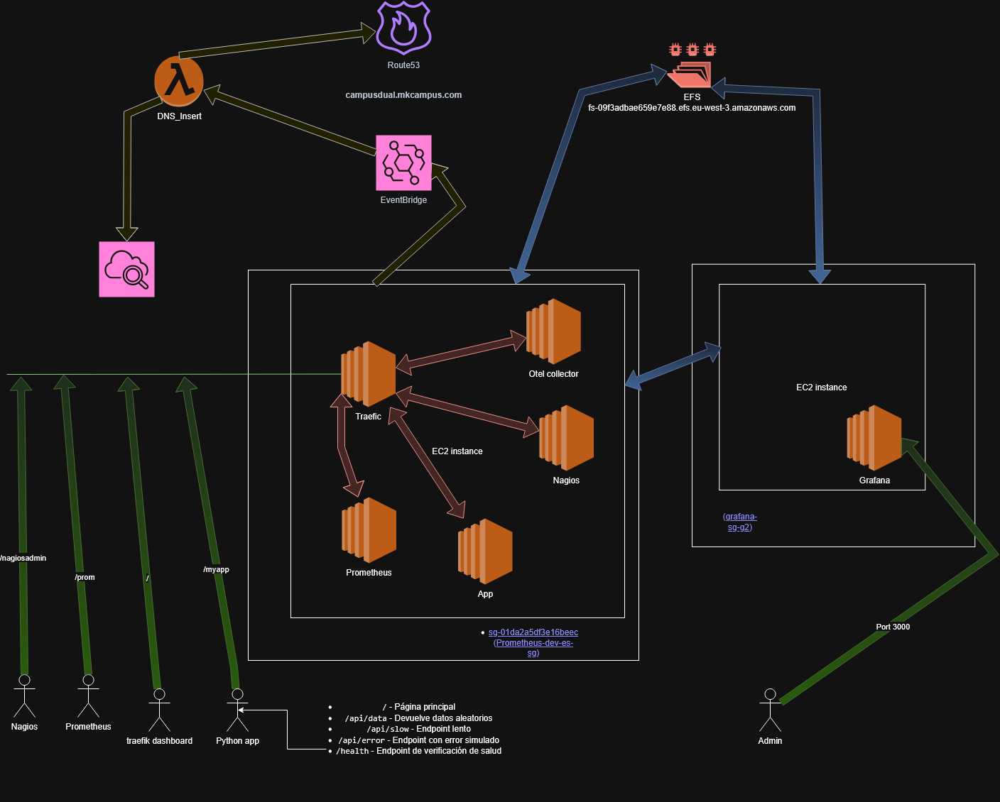

# Prometheus Lab

Este repositorio contiene la infraestructura y configuración para desplegar un entorno de laboratorio de **Prometheus** sobre **AWS**.

## 🗂 Estructura del Proyecto

- **Diagrama de Infraestructura**  
  La siguiente imagen muestra una representación visual del entorno desplegado:

  

> ⚠️ **Aviso:** El diagrama puede no estar actualizado con respecto al estado actual del proyecto.
